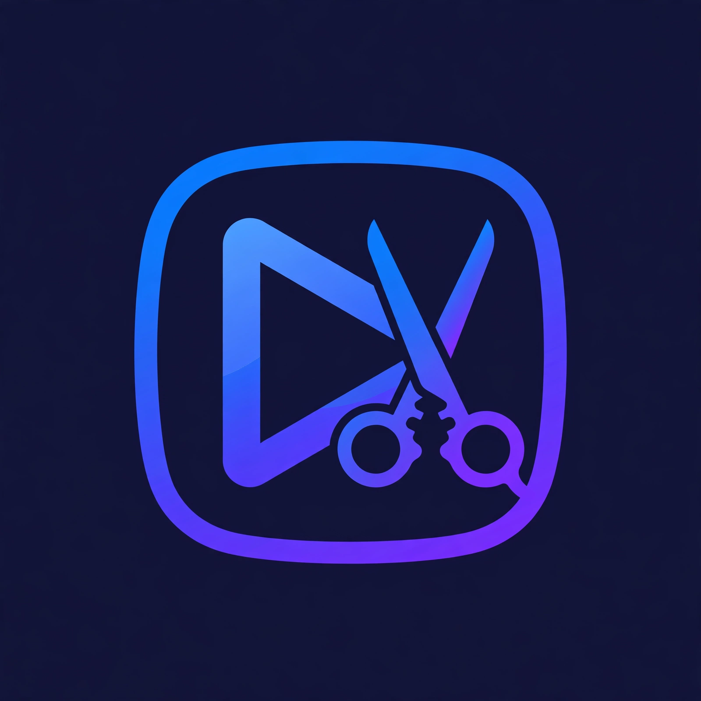

<div align="center">



# NanoClip

### *by Techinfotics*

## Turn long videos into clips worth sharing — with AI

NanoClip watches your video, finds the best moments, writes catchy titles,
and cuts share-ready vertical clips for **TikTok, Reels, Shorts** and more.

[](https://github.com/muazforu/NanoClip/releases/latest)
[](https://github.com/muazforu/NanoClip/stargazers)
[](LICENSE)
[](https://github.com/muazforu/NanoClip/releases/latest)
[](https://github.com/muazforu/NanoClip/releases/latest)

**[⬇️ Download NanoClip](https://github.com/muazforu/NanoClip/releases/latest)**
&nbsp;·&nbsp;
[📖 Installation guide](docs/INSTALLATION.md)
&nbsp;·&nbsp;
[🔑 Get a free API key](docs/INSTALLATION.md#-step-2--get-your-free-gemini-api-key-2-minutes)
&nbsp;·&nbsp;
[🐛 Report an issue](https://github.com/muazforu/NanoClip/issues/new)

[English](README.md) · [简体中文](README-ZH.md) · [日本語](README-JA.md) · [한국어](README-KO.md) · [Español](README-ES.md) · [Português](README-PT.md) · [Русский](README-RU.md) · [Français](README-FR.md)

</div>

---

## 🎬 What is NanoClip?

Got a 2-hour podcast, interview, livestream or lecture? Finding the 30-second
golden moments by hand takes forever. **NanoClip does it for you:**

1. **Import** a video file — or paste a YouTube / Bilibili link.
2. **Transcribe** speech to subtitles automatically (local Whisper, your
   language stays yours).
3. **AI analyzes** the transcript — it scores every moment, finds highlights,
   and writes titles for you.
4. **Review & tweak** the suggested clips in the Studio editor.
5. **Export** vertical 9:16 clips with burned-in subtitles and title cards —
   ready to post.

> 🎙️ **Perfect for:** podcasters, interviewers, teachers, streamers, coaches,
> and anyone who records long videos and wants short-form content without
> hours of manual editing.

---

## ✨ Features

| | |
|---|---|
| 🎯 **AI highlight detection** | Scores every segment of your transcript and picks the moments people will actually watch. |
| ✂️ **Smart clipping** | Generates clips *and* suggested collections (multi-clip compilations) from one video. |
| 📝 **Auto titles** | AI writes catchy titles for every clip — edit anything you don't like. |
| 🌍 **8 interface languages** | English, 中文, 日本語, 한국어, Español, Português, Русский, Français. |
| 🎞️ **Export presets** | One-click presets for TikTok, YouTube Shorts, Instagram Reels, Douyin, Bilibili & more. |
| 💬 **Burned-in subtitles** | Beautiful subtitle styling with custom fonts, plus an animated title card. |
| 🖼️ **Auto covers** | Generates cover images so platforms never reject your upload. |
| 📅 **Publishing** | Publish now or schedule; manage everything from the built-in calendar. |
| 🤖 **Your choice of AI** | Google Gemini, OpenAI-compatible APIs, Qwen — or 100% local with Ollama / LM Studio. |
| 🖥️ **Desktop app + Docker + CLI** | Native Windows/macOS app, self-hosted web UI, or command-line & MCP for automation. |

---

## 🖼️ See it in action


<table>
  <tr>
    <td width="50%" align="center"><strong>AI-generated clips</strong></td>
    <td width="50%" align="center"><strong>Studio preview & editing</strong></td>
  </tr>
  <tr>
    <td><a href="docs/images/clips-v1.4.0.png"></a></td>
    <td><a href="docs/images/studio-v1.4.0.png"></a></td>
  </tr>
</table>

---

## 🚀 Installation

**Easiest (recommended):** download the installer from
**[Releases](https://github.com/muazforu/NanoClip/releases/latest)** —
no Python or technical setup needed.

| Your situation | What to do |
|---|---|
| 🪟 Windows 10/11 (x64) | Download `NanoClip_1.0.0_x64-setup.exe` from [Releases](https://github.com/muazforu/NanoClip/releases/latest) and run it |
| 🍎 macOS (Apple Silicon) | Download the `.dmg` from [Releases](https://github.com/muazforu/NanoClip/releases/latest) |
| 🐳 Self-host / Linux | Run with Docker Compose (5 minutes) |
| ⌨️ Automation / batch jobs | Use the CLI or MCP server (Python 3.10+) |

📖 **Full step-by-step instructions for every option:**
**[docs/INSTALLATION.md](docs/INSTALLATION.md)**

> ⚠️ **Windows SmartScreen note:** the installer isn't code-signed yet, so
> Windows may show *"Windows protected your PC"*. Click **More info → Run
> anyway** — that's normal for new open-source apps.

---

## 🔑 API key setup (2 minutes, free)

NanoClip's AI brain needs a language model. The easiest free option is
**Google Gemini**:

1. Go to **[aistudio.google.com/apikey](https://aistudio.google.com/apikey)**
   and sign in with your Google account.
2. Click **Create API key** → copy it (it's free, with a generous free tier).
3. In NanoClip: **Settings → Model** → provider **Google Gemini** →
   paste your key → model `gemini-flash-lite-latest` →
   **Test connection** → **Save**.

That's it — highlight detection, titles and scoring will use Gemini.

🔒 **Your key stays on your device.** It's stored only in NanoClip's local
settings and is sent only to Google's API. It's never uploaded anywhere else.

**No key? No problem:**
- 🖥️ **Ollama / LM Studio** — run a model locally, no key and no cloud needed.
- 🔌 **OpenAI-compatible APIs** — plug in any compatible provider with a custom Base URL.

Full details, screenshots and troubleshooting:
**[docs/INSTALLATION.md](docs/INSTALLATION.md#-api-key--model-setup)**

---

## 🔄 How it works

```
Import video ─▶ Transcribe (Whisper) ─▶ AI analysis & scoring ─▶ Clips + collections ─▶ Export / publish
     🎥               💬                        🧠                          ✂️                    🚀
```

Video cutting happens **on your device**. Only transcript *text* is sent to
your chosen AI provider for analysis — your footage never leaves your machine
unless you hit Publish.

---

## ❓ Quick FAQ

<details>
<summary><strong>Is NanoClip free?</strong></summary>

Yes — NanoClip is free and open source (MIT). AI providers bill their own
usage: Gemini has a free tier that's plenty for trying it out. Local models
via Ollama are completely free.
</details>

<details>
<summary><strong>Do I need an API key?</strong></summary>

For AI highlight analysis, yes — either a cloud key (Gemini is free) or a
local model via Ollama/LM Studio (no key). Transcription works fully offline
with the built-in Whisper components.
</details>

<details>
<summary><strong>Are my videos uploaded to the cloud?</strong></summary>

No. Editing and cutting happen on your device. Only the transcript text goes
to your AI provider for analysis. Finished clips leave your machine only when
you publish them.
</details>

<details>
<summary><strong>What videos work best?</strong></summary>

Anything with speech: interviews, podcasts, lectures, commentary, livestreams.
Pure music or action footage (no dialogue) won't produce good highlights —
the AI works from the transcript.
</details>

<details>
<summary><strong>No clips were generated — why?</strong></summary>

Usually: the transcription came back empty, the model connection failed, or
the score threshold is too high. Try lowering the threshold from 0.7 to 0.5
in settings, and check the [troubleshooting guide](docs/INSTALLATION.md#troubleshooting).
</details>

---

## 🛠️ Tech stack

**Backend** Python · FastAPI · Celery · Redis · SQLite · FFmpeg · faster-whisper · yt-dlp
**Desktop** Tauri (Rust) · **Frontend** React · TypeScript
**AI** Gemini · OpenAI-compatible · Qwen · Ollama · LM Studio

---

## 🙏 Acknowledgments

NanoClip is built on **[AutoClip](https://github.com/zhouxiaoka/autoclip)**
by zhouxiaoka (MIT licensed) — rebranded, packaged and maintained by
**Techinfotics**. Thanks to the open-source projects that make it possible:
FastAPI, React, Tauri, FFmpeg, yt-dlp, Whisper, and every contributor.

---

## 📄 License

[MIT License](LICENSE) — free for personal and commercial use.

---

<div align="center">

**Made with ❤️ by [Techinfotics](https://techinfotics.online)**

*If NanoClip saves you time, give it a ⭐ — it helps others discover it.*

</div>
